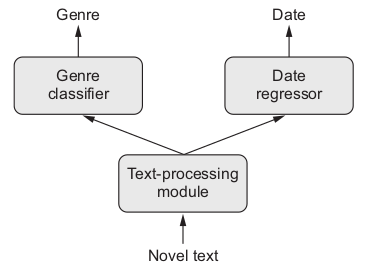

```{r setup, include=FALSE}
options(htmltools.dir.version = FALSE)
```


```{r, load_refs, echo=FALSE, cache=FALSE}
library(RefManageR)
BibOptions(check.entries = FALSE, 
           bib.style = "authoryear", 
           cite.style = 'alphabetic', 
           style = "markdown",
           hyperlink = FALSE, 
           dashed = FALSE)
bib <- ReadBib("1_structured_data/bibliography.bib", check = FALSE)
```

# Topics

- Using the Keras Functional API

- _Entity embeddings_ 1: Extracting relationships

- _Entity embeddings_ 2: Improving accuracy


---
class: inverse, middle, center

# Using the Keras functional API


---
# When the Keras Sequential API is not enough


Let's look at some typical code observing the Sequential API:

```{r, eval=FALSE}
model <- keras_model_sequential() %>%
layer_dense(units = 32, activation = "relu", input_shape = c(64)) %>%
layer_dense(units = 10, activation = "softmax")
```

Or:

```{r, eval=FALSE}
feature_extractor <-
  application_xception(include_top = FALSE, input_shape = c(224, 224, 3))

model <- keras_model_sequential() %>%
  feature_extractor %>%
  layer_dense(units = 512, activation = "relu") %>%
  layer_batch_normalization() %>%
  layer_dropout(rate = 0.5) %>%
  layer_dense(units = 20, activation = "softmax")
```


What can you __not__ do with this kind of architecture?

---
# Multiple inputs

Example tasks:

- Predict the price of an item from metadata (size, color ...), a verbal description, and an image
- Question answering: The NN is given a source text (sentence, paragraph) and a question, and should answer that question


.pull-left[]
.pull-right[]

---
# Multiple outputs

Example tasks:

- For a short story, predict genre and date written

- Predict age, income and gender from a series of tweets of a person

<br />

.pull-left[]
.pull-right[]

---
# Internal branching/submodules

Two famous architectures encountered in computer vision:

- InceptionV[n] family: inception module

- ResNet family: residual connections

.pull-left[]
.pull-right[]

---
# Functional API - Generic example code

```{r, eval=FALSE}
input1 <- layer_input(shape  = 1)
input2 <- layer_input(shape = 1)

dense1 <- input1 %>% layer_dense(units = 32, activation = "relu")
dense2 <- input2 %>% layer_dense(units = 32, activation = "relu")
concat <- layer_concatenate(list(dense1, dense2))

output1 <- concat %>% layer_dense(units = 1, activation = "sigmoid", name = "class_output")
output2 <- concat %>% layer_dense(units = 1, name = "regression_output")

model <- keras_model(inputs = list(input1, input2), outputs = list(output1, output2))

model %>% compile(
  loss = list(class_output = "binary_crossentropy", regression_output = "mse"),
  optimizer = "adam",
  metrics = list(class_output = "binary_crossentropy", regression_output = "mse"))

model %>% fit(
  x = list(x1, x2),
  y = list(y1, y2)
)

```


---
# Multiple inputs - Question answering example

Example task:

- Question answering: The NN is given a source text (sentence, paragraph) and a question, and should answer that question


---
# Multiple inputs - Question answering example


```{r, eval=FALSE}
text_input <- layer_input(shape = list(NULL), name = "text")
encoded_text <- text_input %>%
  layer_embedding(input_dim = 5000, output_dim = 256) %>%
  layer_lstm(units = 128)

question_input <- layer_input(shape = list(NULL), name = "question")
encoded_question <- question_input %>%
  layer_embedding(input_dim = 5000, output_dim = 256) %>%
  layer_lstm(units = 128)

concatenated <- layer_concatenate(list(encoded_text, encoded_question))

answer <- concatenated %>%
  layer_dense(units = 5000, activation = "softmax")
```

---
# Multiple outputs - Multiple feature prediction from tweets

Example task:

- Predict age, income and gender from a series of tweets of a person

<br />


---
# Multiple outputs - Multiple feature prediction from tweets

```{r, eval=FALSE}
posts_input <- layer_input(shape = list(NULL))
embedded_posts <- posts_input %>%
  layer_embedding(input_dim = 10000, output_dim = 256)

base_model <- embedded_posts %>%
  layer_conv_1d(filters = 128, kernel_size = 5, activation = "relu") %>%
  layer_max_pooling_1d(pool_size = 5) %>%
  ## [more conv and pooling layers]
  layer_global_max_pooling_1d() %>%
  layer_dense(units = 128, activation = "relu")

age_prediction <- base_model %>% layer_dense(units = 1, name = "age")
income_prediction <- base_model %>% 
  layer_dense(num_income_groups, activation = "softmax", name = "income")
gender_prediction <- base_model %>%
  layer_dense(units = 1, activation = "sigmoid", name = "gender")

model <- keras_model(
  posts_input,
  list(age_prediction, income_prediction, gender_prediction)
)
```


---
# Inception Module

<br />


---
# Inception Module

```{r, eval=FALSE}
branch_a <- input %>%
  layer_conv_2d(filters = 128, kernel_size = 1, activation = "relu",
                strides = 2)

branch_b <- input %>%
  layer_conv_2d(filters = 128, kernel_size = 1, activation = "relu") %>%
  layer_conv_2d(filters = 128, kernel_size = 3, activation = "relu",
                strides = 2)

branch_c <- input %>%
  layer_average_pooling_2d(pool_size = 3, strides = 2) %>%
  layer_conv_2d(filters = 128, kernel_size = 3, activation = "relu")

branch_d <- input %>%
  layer_conv_2d(filters = 128, kernel_size = 1, activation = "relu") %>%
  layer_conv_2d(filters = 128, kernel_size = 3, activation = "relu") %>%
  layer_conv_2d(filters = 128, kernel_size = 3, activation = "relu",
                strides = 2)

output <- layer_concatenate(list(branch_a, branch_b, branch_c, branch_d))
```

---
# Residual connections

<br />


---
# Residual connections

```{r, eval=FALSE}
output <- input %>%
  layer_conv_2d(filters = 128, 
                kernel_size = 3,
                activation = "relu",
                padding = "same") %>%
  layer_conv_2d(filters = 128,
                kernel_size = 3,
                activation = "relu",
                padding = "same") %>%
  layer_max_pooling_2d(pool_size = 2, strides = 2)

# we need to do some downsampling on the residual
# so we can add it to output
residual <- input %>%
  layer_conv_2d(filters = 128,
                kernel_size = 1,
                strides = 2,
                padding = "same")

output <- layer_add(list(output, residual))
```

---
# Exercise: Predict salary on the "Census Income" dataset (Part 1)


- "Census Income" (a.k.a. "Adult") dataset available at [UCI Machine Learning Repository](http://mlr.cs.umass.edu/ml/datasets/Census+Income)

- Task is to predict predict binarized salary (< resp. > 50k)

- The dataset has continuous as well as categorical variables

- Notebook to follow along: [1_structured_data/1_heterogeneous_data_1.Rmd](1_structured_data/1_heterogeneous_data_1.Rmd) 

- Quiz: [1_structured_data/structured_data_quizzes.Rmd](1_structured_data/structured_data_quizzes.Rmd)

---
class: inverse, middle, center

# Entity embeddings are all the hype

---
# Most people know embeddings for this<sup>1</sup>


```{r, echo=FALSE, results=FALSE}
c1 <- Citet(bib, key = "MikolovSCCD13", .opts = list(cite.style = "authoryear"))
```

.footnote[[1] cf. Mikolov, T, I. Sutskever, K. Chen, et al. (2013). "Distributed Representations of Words and Phrases and their Compositionality". ]

#### But not just words or sentences can be embedded... we can embed relations/concepts/__entities__ of all kinds

---
# So why would we do that?

<br />

- Improve accuracy on downstream task

- Extract relationships between entities (not visible in one-hot-encoded form)

- Everything in-between

<br /> 
For an application to e.g. collaborative filtering, see

[Collaborative filtering with embeddings](https://blogs.rstudio.com/tensorflow/posts/2018-09-26-embeddings-recommender/)


---
class: inverse, middle, center

# Entity embeddings 1: Extracting relationships

---
# Extracting embeddings from a trained model

- _The embeddings_, that's the weight matrix of an embedding layer

- We obtain the weights from the model and then, can perform dimensionality reduction on it

 - PCA
 - t-SNE
 - ...
 
- Can also calculate similarity between points

- For example, using _cosine similarity_:

$$cos(\theta) = \frac{\mathbf{x^ t}\mathbf{y}}{\mathbf{||x||}\space\mathbf{||y||}}$$


Let's see this in action!


---
# Use entity embeddings on the StackOverflow Developer Survey

- The [StackOverflow developer survey](https://insights.stackoverflow.com/survey/2018) has lots of categorical variables that can be used as predictors and/or as targets

- Notebook: [1_structured_data/2_embeddings_so.Rmd](1_structured_data/2_embeddings_so.Rmd)

- Data: [1_structured_data/data/survey_results_public.csv](1_structured_data/data/survey_results_public.csv)

- Variable explanations: [1_structured_data/data/survey_results_schema.csv](1_structured_data/data/survey_results_schema.csv)

- Quiz: [1_structured_data/structured_data_quizzes.Rmd](1_structured_data/structured_data_quizzes.Rmd)

<br />

We'll go through the notebook together and then, you'll pick some variables you're interested in and experiment with them.


---
class: inverse, middle, center

# Entity embeddings 2: Improving accuracy


---
# Using entity embeddings to improve accuracy

- Used by the winning team on the Kaggle Rossmann Sales prediction challenge<sup>1</sup>

- Better accuracy compared to one-hot-encoding is not guaranteed

- Probably most effective with _high-dimensional_ data that have a _significant relationship_ to the target variable


```{r, echo=FALSE, results=FALSE}
c1 <- Citet(bib, key = "GuoB16", .opts = list(cite.style = "authoryear"))
```

.footnote[[1] cf. Guo, C. and F. Berkhahn (2016). "Entity Embeddings of Categorical Variables". ]


---
# Using entity embeddings for fraud detection

<br />

- `sales` dataset from the `DMwR2` package

- Notebook: [1_structured_data/3_embeddings_fraud.Rmd](1_structured_data/3_embeddings_fraud.Rmd)

- Quiz: [1_structured_data/structured_data_quizzes.Rmd](1_structured_data/structured_data_quizzes.Rmd)

<br />

Again, we'll go through the notebook together and then, you'll try to further improve accuracy.

---
# Exercise: "Census Income" dataset (Part 2) (Optional)

<br />

- On the now familiar "Census Income" dataset, see if you can improve accuracy using embeddings.

- Before we start: How probable do you think it is you can improve accuracy there?

- Notebook to follow along: [1_structured_data/4_heterogeneous_data_2.Rmd](1_structured_data/4_heterogeneous_data_2.Rmd)

- Quiz: [1_structured_data/structured_data_quizzes.Rmd](1_structured_data/1_structured_data_quizzes.Rmd)

---
# Wrapup/feedback


---
# References

```{r, results='asis', echo=FALSE}
PrintBibliography(bib)
```
