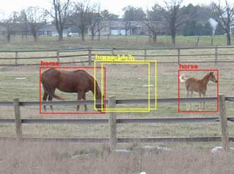
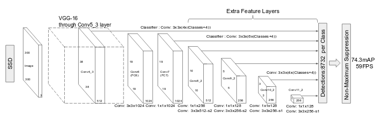
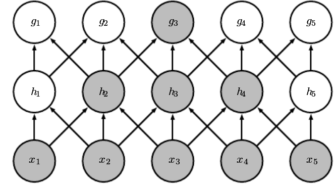

```{r setup, include=FALSE}
options(htmltools.dir.version = FALSE)
```


```{r, load_refs, echo=FALSE, cache=FALSE}
library(RefManageR)
BibOptions(check.entries = FALSE, 
           bib.style = "authoryear", 
           cite.style = 'alphabetic', 
           style = "markdown",
           hyperlink = FALSE, 
           dashed = FALSE)
bib <- ReadBib("2_object_detection/bibliography.bib", check = FALSE)
```

# Learning objectives

- Perform classification and localization on a single object 

- Important concepts in multiple-object detection

- Understand how to code a _very_ basic version of SSD (__Single-Shot Multibox Detector__)

- Understand the options to improve on this basic detector

---
class: inverse, middle, center

# Road to object detection

---
# Single-object classification and localization

- Mix of recap (if you've participated in yesterday's workshop) and new topics

- Partly demo, partly exercise

- We'll also look at the dataset and preprocessing required for this session


---
# PASCAL Visual Object Classes (VOC) challenges and datasets

- Challenges (2005-2012) included
 - classification (presence/absence for each object class)
 - object detection (same as above, plus localization)
 - class segmentation
 - "person layout"
 
- We'll use the training set from the [2007 challenge](http://host.robots.ox.ac.uk/pascal/VOC/voc2007/index.html)

- Number of object classes: 20

- Number of training images: 2501

- We focus on concepts and the how-to, not accuracy

---
# Object detection examples


---
# How do you learn bounding boxes?

- Can be framed as __regression problem__

 - often trained with mean absolute error

- Predict pixel coordinates of box corners (_x_left_, _y_top_, _x_right_, _y_bottom_)

- Relevant metric is __Intersection over Union__ (__IOU__), also known as Jaccard index<sup>1</sup>


.footnote[[1] Image source: Wikipedia.]


---
# Demo/exercise: Single-object classification and localization

- Notebook: [2_object_detection/1_classification_localization.Rmd](2_object_detection/1_classification_localization.Rmd)

- Quiz: [2_object_detection/object_detection_quizzes.Rmd](2_object_detection/object_detection_quizzes.Rmd)


---
class: inverse, middle, center

# Introduction to multiple-object detection


---
# Why can't we just have more bounding boxes?


Each bounding box detector will try to detect all objects:<sup>1</sup>



We need to either:

- zoom in on single objects in some way, or
- have detectors __specialize__ in what to detect

.footnote[[1] Image source: http://machinethink.net/blog/object-detection/]

---
# Object detection main approaches / paradigms

- Sliding windows approaches
 - Train network, run sequentially on image patches 
 - May actually run sliding windows synchronously (see _Overfeat_ below)

- Region proposal approaches (2-step)
 - Step 1: Some algorithm proposes interesting regions
 - Step 2: Another algorithm (a convnet) classifies the regions and refines localization

- Single-shot detectors (YOLO, SSD)
 - Perform detection, classification and localization in one step

---
# Sliding windows done synchronously

```{r, echo=FALSE, results=FALSE}
c1 <- Citet(bib, key = "SermanetEZMFL13", .opts = list(cite.style = "authoryear"))
```

.footnote[[1] cf. Sermanet, P, D. Eigen, X. Zhang, et al. (2013). OverFeat: Integrated Recognition, Localization and Detection using Convolutional Networks. ]


---
# Region proposal approaches

- R-CNN<sup>1</sup>: Uses non-DL algorithm to select interesting regions, then applies CNN to all identified regions sequentially

- Fast R-CNN<sup>2</sup>: Uses non-DL algorithm to select interesting regions, then classifies all regions in one pass

- Faster R-CNN<sup>3</sup>: Uses a convnet for region proposal (_Region proposal network_), then classifies all regions in one pass

```{r, echo=FALSE, results=FALSE}
c1 <- Citet(bib, key = "GirshickDDM13", .opts = list(cite.style = "authoryear"))
c2 <- Citet(bib, key = "Girshick15", .opts = list(cite.style = "authoryear"))
c3 <- Citet(bib, key = "RenHG015", .opts = list(cite.style = "authoryear"))
```

<span class="footnote">
[1] cf. Girshick, R. B. (2015). Fast R-CNN.<br />
[2] cf. Girshick, R. B, J. Donahue, T. Darrell, et al. (2013). Rich feature hierarchies for accurate object detection and semantic segmentation.<br />
[3] cf. Ren, S, K. He, R. B. Girshick, et al. (2015). Faster R-CNN: Towards Real-Time Object Detection with Region Proposal Networks.
</span>


---
# Single-shot detectors

Make detectors __specialize__ using __anchor boxes__<sup>1</sup>


```{r, echo=FALSE, results=FALSE}
c1 <- Citet(bib, key = "LiuAESR15", .opts = list(cite.style = "authoryear"))
```

.footnote[[1] illustration from: Liu, W, D. Anguelov, D. Erhan, et al. (2015). SSD: Single Shot MultiBox Detector.]


---
# Why do anchor boxes help?

### Concept 1: Grid

By laying a grid over the image, we _map detectors to image regions_.

### Concept 2: Different aspect ratios and scales

Objects of different shapes are localized more easily because we lean on different customized _priors_.

<br />


---
# SSD architecture

<br />

How do we detect objects that are of completely different sizes than a grid cell (e.g., span the whole image)?

SSD adds anchor boxes at different resolutions:



---
# SSD vs. YOLO

- Early YOLO versions (v1<sup>1</sup>/v2<sup>2</sup>) had dense layers before the final output, but current YOLO<sup>3</sup> is fully convolutional just like SSD

- In addition to _number of classes_ class scores and 4 bounding box coordinates __per detector__, YOLO also has a _confidence score_

- YOLO determines anchor boxes for each dataset individually (using k-means clustering on the actual bounding boxes), while SSD uses _default boxes_

- Details of bounding box computations differ

```{r, echo=FALSE, results=FALSE}
c1 <- Citet(bib, key = "RedmonDGF15", .opts = list(cite.style = "authoryear"))
c2 <- Citet(bib, key = "RedmonF16", .opts = list(cite.style = "authoryear"))
c3 <- Citet(bib, key = "abs-1804-02767", .opts = list(cite.style = "authoryear"))
```

<span class="footnote">
[1] cf. Redmon, J, S. K. Divvala, R. B. Girshick, et al. (2015). You Only Look Once: Unified, Real-Time Object Detection. <br />
[2] cf. Redmon, J. and A. Farhadi (2016). YOLO9000: Better, Faster, Stronger. <br />
[3] cf. Redmon, J. and A. Farhadi (2018). YOLOv3: An Incremental Improvement.
</span>

---
# Why fully convolutional?

As long as for every detector, the part of the image it's responsible for is visible (= is in its receptive field), we don't need a fully connected layer at the end<sup>1</sup>

<br />



```{r, echo=FALSE, results=FALSE}
c1 <- Citet(bib, key = "Goodfellow-et-al-2016", .opts = list(cite.style = "authoryear"))
```

.footnote[[1] Image from: Goodfellow, I, Y. Bengio and A. Courville (2016). Deep Learning.]

---
class: inverse, middle, center

# Coding a (very!) basic single-shot detector


---
# Basic SSD: Code

- To show the basic approach, we will
 - restrict ourselves to a 4x4 grid of image cells
 - have one anchor box per cell (thus, 16 anchor boxes)
 - don't aggregate detections from different resolutions 

- Notebook: [2_object_detection/2_object_detection_ssd.Rmd](2_object_detection/2_object_detection_ssd.Rmd)


---
# Basic SSD: Ways for improvement

- Use focal loss

- Use anchor boxes of different aspect ratios

- Perform detection at various resolutions

- (not object detection specific:) Use data augmentation


---
# Focal Loss<sup>1</sup>


```{r, echo=FALSE, results=FALSE}
c1 <- Citet(bib, key = "abs-1708-02002", .opts = list(cite.style = "authoryear"))
```

.footnote[[1] Image from: Lin, T, P. Goyal, R. B. Girshick, et al. (2017). Focal Loss for Dense Object Detection.]


---
# Focal loss, and more anchors

<br />

Implementation stubs:

- Focal loss: [2_object_detection/3_object_detection_ssd_focal.Rmd](2_object_detection/3_object_detection_ssd_focal.Rmd)


- More anchors: [2_object_detection/4_object_detection_ssd_moreanchors.Rmd](2_object_detection/4_object_detection_ssd_moreanchors.Rmd)

---
# Wrapup / feedback

---
# References

```{r, results='asis', echo=FALSE}
PrintBibliography(bib, start = 1, end = 5)
```

---
# References (cont.)

```{r, results='asis', echo=FALSE}
PrintBibliography(bib, start = 6, end = 10)
```

