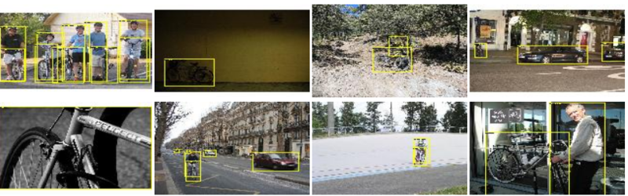
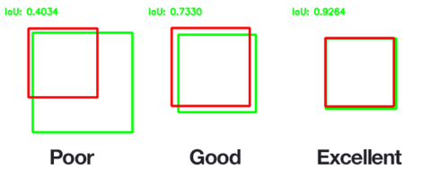

```{r setup, include=FALSE}
options(htmltools.dir.version = FALSE)
```


```{r, load_refs, echo=FALSE, cache=FALSE}
library(RefManageR)
BibOptions(check.entries = FALSE, 
           bib.style = "authoryear", 
           cite.style = 'alphabetic', 
           style = "markdown",
           hyperlink = FALSE, 
           dashed = FALSE)
bib <- ReadBib("2_object_detection/bibliography.bib", check = FALSE)
```

# Topics

- Road to object detection: Single-object classification and localization

- Introduction to multiple-object detection

- Coding a basic SSD (__Single-Shot Multibox Detector__)

---
class: inverse, middle, center

# Road to object detection

---
# Single-object classification and localization

- Mix of recap (if you've participated in yesterday's workshop) and new topics

- Partly demo, partly exercise

- We'll also look at the dataset and preprocessing required for this session


---
# PASCAL Visual Object Classes (VOC) challenges and datasets

- Challenges (2005-2012) included
 - classification (presence/absence for each object class)
 - object detection (same as above, plus localization)
 - class segmentation
 - "person layout"
 
- We'll use the training set from the [2007 challenge](http://host.robots.ox.ac.uk/pascal/VOC/voc2007/index.html)

- Number of object classes: 20

- Number of training images: 2501

- We focus on concepts and the how-to, not accuracy

---
# Object detection examples





---
# How do you learn bounding boxes?

- Can be framed as __regression problem__

 - often trained with mean absolute error

- Predict pixel coordinates of box corners (`x_left`, `y_top`, `x_right`, `y_bottom`)

- Relevant metric is __Intersection over Union__ (__IOU__), also known as Jaccard index<sup>1</sup>


.footnote[[1] Image source: Wikipedia.]



---
# Demo/exercise: Single-object classification and localization

- Notebook: [2_object_detection/1_classification_localization.Rmd](2_object_detection/1_classification_localization.Rmd)

- Quiz: [2_object_detection/object_detection_quizzes.Rmd](2_object_detection/object_detection_quizzes.Rmd)


---
class: inverse, middle, center

# Introduction to multiple-object detection


---
# How do we extend this to detect multiple objects?

- Sliding windows approaches
 - Train network, run sequentially on image patches 
 - May actually run sliding windows synchronously (see _Overfeat_ below)

- Region proposal approaches (2-step)
 - Step 1: Some algorithm proposes interesting regions
 - Step 2: Another algorithm (a convnet) classifies the regions and refines localization

- Single-shot detectors (YOLO, SSD)
 - Perform detection, classification and localization in one step

---
# Sliding windows done synchronously

```{r, echo=FALSE, results=FALSE}
c1 <- Citet(bib, key = "SermanetEZMFL13", .opts = list(cite.style = "authoryear"))
```

.footnote[[1] cf. Sermanet, P, D. Eigen, X. Zhang, et al. (2013). OverFeat: Integrated Recognition, Localization and Detection using Convolutional Networks. ]


---
# Region proposal approaches

- R-CNN<sup>1</sup>: Uses non-DL algorithm to select interesting regions, then applies CNN to all identified regions sequentially

- Fast R-CNN<sup>2</sup>: Uses non-DL algorithm to select interesting regions, then classifies all regions in one pass

- Faster R-CNN<sup>3</sup>: Uses a convnet for region proposal (_Region proposal network_), then classifies all regions in one pass

```{r, echo=FALSE, results=FALSE}
c1 <- Citet(bib, key = "GirshickDDM13", .opts = list(cite.style = "authoryear"))
c2 <- Citet(bib, key = "Girshick15", .opts = list(cite.style = "authoryear"))
c3 <- Citet(bib, key = "RenHG015", .opts = list(cite.style = "authoryear"))
```

<span class="footnote">
[1] cf. Girshick, R. B. (2015). Fast R-CNN.<br />
[2] cf. Girshick, R. B, J. Donahue, T. Darrell, et al. (2013). Rich feature hierarchies for accurate object detection and semantic segmentation.<br />
[3] cf. Ren, S, K. He, R. B. Girshick, et al. (2015). Faster R-CNN: Towards Real-Time Object Detection with Region Proposal Networks.
</span>


---
# Single-shot detectors

"Synchronous sliding window" (à la _Overfeat_) enhanced by idea of __anchor boxes__


---
# Dense (Yolo v1/2) vs. fully convolutional


---
# Why fully convolutional?

Receptive field

---
class: inverse, middle, center

# Coding a basic SSD (Single-Shot Multibox Detector)


---
# Basic SSD: Code

- To show the basic approach, we will
 - restrict ourselves to a 4x4 grid of image cells
 - have one anchor box per cell (thus, 16 anchor boxes)
 - work with one scale of image only 

- Notebook: [2_object_detection/2_object_detection_ssd.Rmd](2_object_detection/2_object_detection_ssd.Rmd)


---
# Basic SSD: Ways for improvement


- Use anchor boxes of different shapes

- Perform detection at various resolutions


---
# References

```{r, results='asis', echo=FALSE}
PrintBibliography(bib)
```
