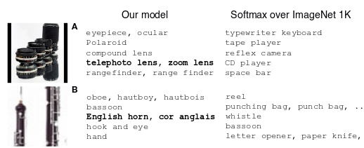

```{r setup, include=FALSE}
options(htmltools.dir.version = FALSE)
```


```{r, load_refs, echo=FALSE, cache=FALSE}
library(RefManageR)
BibOptions(check.entries = FALSE, 
           bib.style = "authoryear", 
           cite.style = 'alphabetic', 
           style = "markdown",
           hyperlink = FALSE, 
           dashed = FALSE)
bib <- ReadBib("4_meta/bibliography.bib", check = FALSE)
```

# Learning objectives

- Develop a basic understanding of what representation learning is, and get to know one of the most important architectures: Variational autoencoders

- Use two established models for explaining model decisions: LIME and Class Activation Maps (CAM)

- Get to know a promising method of indicating uncertainty in DL models: Dropout uncertainty

<br />

_Caution_ ... We're (partly) off to uncharted territory now:

- Terms are not necessarily well-defined
- No out-of-the-box solutions
- You will have to evaluate what's useful _to you_
- We just present techniques to choose from / adapt / extend ...
- The idea being: Enable you to apply what's useful to you _in your area of work/interest_


---
class: inverse, middle, center

# Representation learning


---

# Representation matters.


Your task: Separate the green triangles from the blue circles.<sup>1</sup>


```{r, echo=FALSE, results=FALSE}
c1 <- Citet(bib, key = "Goodfellow-et-al-2016", .opts = list(cite.style = "authoryear"))
```

.footnote[[1] Goodfellow, I, Y. Bengio and A. Courville (2016). Deep Learning.]

---

# What makes one representation better than another?

Good representations make a subsequent prediction task easier.<sup>1, 2</sup>

Examples: 

- unsupervised pretraining (make use of vast amounts of unlabeled data)
- transfer learning (use features learned on one task for solving another task)
- use relations learned on one domain to infer relationships on another


```{r, echo=FALSE, results=FALSE}
c1 <- Citet(bib, key = "Goodfellow-et-al-2016", .opts = list(cite.style = "authoryear"))
c2 <- Citet(bib, key = "5538", .opts = list(cite.style = "authoryear"))
```

<span class="footnote">
[1] See chapter 15 in Goodfellow, I, Y. Bengio and A. Courville (2016). Deep Learning.<br />
[2] Also, Bengio, Y, A. C. Courville and P. Vincent (2012). Unsupervised Feature Learning and Deep Learning: A Review and New Perspectives.
</span>

---
# Example: Zero-shot learning with DeVise

- Frome et al.<sup>1</sup> trained an image classification model to predict label embeddings (that had been learned in an unsupervised manner) instead of the labels themselves

- This allows for meaningful classification of objects not encountered before



```{r, echo=FALSE, results=FALSE}
c1 <- Citet(bib, key = "FromeCSBDRM13", .opts = list(cite.style = "authoryear"))
```

.footnote[[1] Frome, A., G. S. Corrado, J. Shlens, et al. (2013). DeViSE: A Deep Visual-Semantic Embedding Model.]


---
# To allow for good generalization, good latent features are

- causal

- disentangled

- smooth

- possibly, hierarchical

- shared across domains / tasks

- sparse 

---
# Example: Disentanglement

- Radford et al.<sup>1</sup> showed they could perform word-vector-like arithmetic manipulations on the space learned by a DCGAN (deep generative adversarial network):


```{r, echo=FALSE, results=FALSE}
c1 <- Citet(bib, key = "RadfordMC15", .opts = list(cite.style = "authoryear"))
```

.footnote[[1] Radford, A, L. Metz and S. Chintala (2015). Unsupervised Representation Learning with Deep Convolutional Generative Adversarial Networks.]

---
# Other uses of representation learning

Besides improving prediction, latent spaces (resp. learned distributions) also figure prominently in:

- object generation

- evaluating data likelihood at test time

- learning conditional relationships

--

<br />

Let's see an example!

---

# Variational autoencoders (VAEs)


---

# Variational autoencoder (in words)

- Encoder is a network

- Decoder is a network

- Latent space represents mean and variance of an approximating distribution $q(z)$

- Latent space is regularized by a prior, often an isotropic Gaussian

- Learning objective is a tradeoff between faithful input reconstruction and conforming to that regularizing prior:

<br />

Minimize: Evidence lower bound (ELBO)

$$\Large ELBO\ = \ E[log\ p(x|z)]\ -\ KL(q(z)||p(z))$$


---
# VAE variants

VAEs learning to minimize the __ELBO__ may:

- learn an uninformative latent space

- optimize the objective yet ignore the prior 

- tend to overfit the data

__InfoVAE__ and subtypes ( $\beta$ -VAE, MMD-VAE)

- are designed to learn more meaningful features

- e.g. by maximizing __mutual information__ between latent space prior and posterior


<br />

We'll see a subtype (__MMD-VAE__) soon. But before, we need some background on


---
class: inverse, middle, center

# Eager execution


---

# (TensorFlow) Keras with eager execution

- Train a Keras model without building a graph

- Operations return values, not tensors

- Can inspect what goes in and comes out of an operation simply by printing a variable's contents

- Makes model development and debugging a lot easier
  
--

#### Detailed examples on the TensorFlow for R blog:

- [More flexible models with TensorFlow eager execution and Keras](https://blogs.rstudio.com/tensorflow/posts/2018-10-02-eager-wrapup/)
- [Image-to-image translation with pix2pix](https://blogs.rstudio.com/tensorflow/posts/2018-09-20-eager-pix2pix/)
- [Attention-based Image Captioning with Keras](https://blogs.rstudio.com/tensorflow/posts/2018-09-17-eager-captioning/)
- [Neural style transfer with eager execution and Keras](https://blogs.rstudio.com/tensorflow/posts/2018-09-10-eager-style-transfer/)
- [Generating images with Keras and TensorFlow eager execution](https://blogs.rstudio.com/tensorflow/posts/2018-08-26-eager-dcgan/)
- [Attention-based Neural Machine Translation with Keras](https://blogs.rstudio.com/tensorflow/posts/2018-07-30-attention-layer/)


---
# Eager execution exercise

- notebook: [4_meta/1_eager_intro.Rmd](4_meta/1_eager_intro.Rmd)

- exercise: [4_meta/meta_quizzes.Rmd](4_meta/meta_quizzes.Rmd)


---
class: inverse, middle, center

# Variational autoencoder (MMD-VAE)

---

# Representation learning with MMD-VAE

- Idea described in _InfoVAE: Information Maximizing Variational Autoencoders_<sup>1</sup>

- Read up later here: [Representation learning with MMD-VAE](https://blogs.rstudio.com/tensorflow/posts/2018-10-22-mmd-vae)

- Complete code here: [mmd_cvae.R](https://github.com/rstudio/keras/blob/master/vignettes/examples/mmd_cvae.R)

- We'll take a bird's view here, not going into every detail

```{r, echo=FALSE, results=FALSE}
c1 <- Citet(bib, key = "ZhaoSE17b", .opts = list(cite.style = "authoryear"))
```

.footnote[[1] cf. Zhao, S, J. Song and S. Ermon (2017). InfoVAE: Information Maximizing Variational Autoencoders.]

---
#### Task: learn a latent space on Fashion-MNIST (https://github.com/zalandoresearch/fashion-mnist)


---
# MMD-VAE, main steps (1): data streaming

We use _tfdatasets_ to stream the data.

```{r, eval=FALSE}
library(keras)
use_implementation("tensorflow")
library(tensorflow)
tfe_enable_eager_execution(device_policy = "silent")

library(tfdatasets) 

fashion <- dataset_fashion_mnist()
c(train_images, train_labels) %<-% fashion$train
c(test_images, test_labels) %<-% fashion$test

train_x <- train_images %>% `/`(255) %>% k_reshape(c(60000, 28, 28, 1))
test_x <- test_images %>% `/`(255) %>% k_reshape(c(10000, 28, 28, 1))

buffer_size <- 60000
batch_size <- 100
{{train_dataset <- tensor_slices_dataset(train_x) %>%
  dataset_shuffle(buffer_size) %>%
  dataset_batch(batch_size)}}
```

---
# MMD-VAE, main steps (2): encoder model

The encoder actually is a downsampling convolutional encoder:

```{r, eval=FALSE}
encoder_model <- function(name = NULL) {
  {{keras_model_custom(name = name, function(self) {}}
    
{{    self$conv1 <- 
      layer_conv_2d(}}             
        # [...]
      )
     self$conv2 <-
      layer_conv_2d(
        # [...]
      )
    self$flatten <- layer_flatten()
   {{self$dense <- layer_dense(units = latent_dim)}}  
    
    function (x, mask = NULL) {
      x %>%
        self$conv1() %>%
        self$conv2() %>%
        self$flatten() %>%
        self$dense()
    }})}
```


---
# MMD-VAE, main steps (3): decoder model

The decoder counteracts downsampling by upsampling again, starting from randomly drawn values from latent space:

```{r, eval=FALSE}
decoder_model <- function(name = NULL) {
  
  keras_model_custom(name = name, function(self) {
    self$dense <- layer_dense(units = 7 * 7 * 32, activation = "relu")
    self$reshape <- layer_reshape(target_shape = c(7, 7, 32))
{{    self$deconv1 <-}} # first of 3 up-convolutions
      layer_conv_2d_transpose(
        # [...]
      )
 {{ self$deconv2 <- }} # [...]  another conv_2d_transpose, filters=32
 {{ self$deconv3 <- }} # [...]  another conv_2d_transpose, filters=1
    function (x, mask = NULL) {
      x %>%
        self$dense() %>%
        self$reshape() %>%
        self$deconv1() %>%
        self$deconv2() %>%
        self$deconv3()
    }})}
```


---
# MMD-VAE, main steps (4): MMD loss

- The loss, __maximum mean discrepancy__ (MMD), is based on the idea that two distributions are identical if and only if all moments are identical. 

- Concretely, similarity between distributions is estimated using a _kernel_, such as the Gaussian kernel

$$\Large k(z,z')=\frac{e^{||z-z'||}}{2\sigma^2}$$

- The idea then is:

<br />

If two distributions are identical, the average __within-distribution__ similarity should be identical to the average __between-distributions__ similarity:

$$\Large MMD(p(z)||q(z))=E_{p(z),p(z')}[k(z,z')]+E_{q(z),q(z')}[k(z,z')]−2E_{p(z),q(z')}[k(z,z')]$$

---
# MMD-VAE, main steps (4): MMD loss (code)

Implementing this loss amounts to just a few lines of code:

```{r, eval=FALSE}
compute_kernel <- function(x, y) {
  # here we use a Gaussian kernel
  # [...]
}

compute_mmd <- function(x, y, sigma_sqr = 1) {
  
  x_kernel <- compute_kernel(x, x)
  y_kernel <- compute_kernel(y, y)
  xy_kernel <- compute_kernel(x, y)
  k_mean(x_kernel) + k_mean(y_kernel) - 2 * k_mean(xy_kernel)
  
}
```


---
# MMD-VAE, main steps (5): training loop

```{r, eval=FALSE}
for (epoch in seq_len(num_epochs)) {
  
  iter <- make_iterator_one_shot(train_dataset)
  until_out_of_range({
    
    x <-  iterator_get_next(iter)
    with(tf$GradientTape(persistent = TRUE) %as% tape, {
      
      mean <- encoder(x)
      preds <- decoder(mean)
      true_samples <- k_random_normal(
        shape = c(batch_size, latent_dim), dtype = tf$float64)
    {{loss_mmd <- compute_mmd(true_samples, mean)
    loss_nll <- k_mean(k_square(x - preds))
    loss <- loss_nll + loss_mmd}}
    })
    
    #[...] here come the usual lines for gradient calculation/application
    # that you've seen in the intro to eager execution
    
  })}
```


---
# MMD-VAE: Generated images

Here are images generated from (unordered) random samples:


---
# MMD-VAE: Latent space

And here we see how the different types of clothing cluster in latent space.


---
# MMD-VAE: Interpolations

(Drum roll:) Here finally we see clothes "morphing into each other" when drawing samples from an evenly spaced grid in latent space.


---
# Variational autoencoders: Exercise


Exercise: [4_meta/meta_quizzes.Rmd](4_meta/meta_quizzes.Rmd)


---
class: inverse, middle, center

# Interpretability

---
# Interpretability: Terminology

You will see terminology distinguishing between

- _interpreting a model_ (as a whole) and _explaining model decisions_ (individual predictions)

- _interpretable models_ and _model-agnostic post-hoc interpretation tools_ 

- _global_ and _local_ post-hoc explanations


__But:__

- No technique is interpretable _per se_ (think lots of - possibly collinear - predictors in a linear regression)<sup>1</sup>

- model-agnostic interpretation tools are models themselves (and thus, have their model-specific assumptions)


```{r, echo=FALSE, results=FALSE}
c1 <- Citet(bib, key = "Lipton16a", .opts = list(cite.style = "authoryear"))
```


.footnote[[1] Lipton, Z. C. (2016). "The Mythos of Model Interpretability". ]


---
# LIME<sup>1</sup>

LIME provides sparse linear approximations by 

- permuting _interpretable features_ of a sample,
- getting predictions,
- weighing them by distance to the instance being explained, and 
- learning a local decision boundary.


```{r, echo=FALSE, results=FALSE}
c1 <- Citet(bib, key = "RibeiroSG16", .opts = list(cite.style = "authoryear"))
```

.footnote[[1] cf. Ribeiro, M. T, S. Singh and C. Guestrin (2016). Why Should I Trust You?: Explaining the Predictions of Any Classifier. ]


.pull-left[]
.pull-right[]

---
# LIME on images


- With images, the interpretable features are so-called _superpixels_ (homogeneous regions of pixels)

- As LIME works by switching presence of superpixels on and off, obtaining an explanation for a high-res image can take some time

- We will thus resize images before passing them to LIME (and anyway the model will work with a resolution of 224x224)

.pull-left[]
.pull-right[]


---
# LIME (1): Create an explainer

We first create an _explainer_ using the _lime_ factory function

```{r, eval=FALSE}
# the first argument is the path to the image
# the second argument should indicate to LIME the type of model
# the third argument is a preprocessing function we need to define

explainer <- lime(img_path, as_classifier(model, labels), image_prep)
```

<br />

And here's the preprocessing function that has to be passed to _lime_

```{r, eval=FALSE}
image_prep <- function(x) {
  arrays <- lapply(x, function(path) {
    img <- image_load(path, target_size = c(224,224)) %>%
      image_to_array()
    img <- img %>%
      array_reshape(c(1, dim(img))) %>%
      imagenet_preprocess_input()
  })
  do.call(abind::abind, c(arrays, list(along = 1)))
}
```


---
# LIME(2): Get a prediction

Getting a prediction also allows for testing the preprocessing function:

```{r, eval=FALSE}
preds <- predict(model, image_prep(img_path))
```

<br />

Decode prediction:

```{r, eval=FALSE}
preds %>% imagenet_decode_predictions()
```

```
  class_name   class_description      score
1  n02782093           balloon    9.999470e-01
2  n03888257         parachute    3.710761e-05
3  n02692877           airship    1.597529e-05
4  n04562935       water_tower    4.031146e-08
5  n04507155          umbrella    2.227399e-08
```

---
# LIME (3): Explore different settings for number of superpixels

Try finding a good setting for the number of superpixels before actually getting an explanation:

```{r, eval=FALSE}
# weight parameter: How high should locality be weighted compared to colour.
plot_superpixels(img_path, colour = "cyan",
                 n_superpixels = 50, weight = 10)

plot_superpixels(img_path, colour = "cyan",
                 n_superpixels = 200, weight = 10)
```


---
# LIME (4): Get explanation

Call _explain_ with the path to the image, the _explainer_, and optional parameters:

```{r, eval=FALSE}
explanation <- explain(
  img_path, 
  explainer,
  n_labels = 1, 
  n_features = 200,
  n_superpixels = 200)
```

```{r, eval=FALSE}
plot_image_explanation(explanation, fill_alpha = 0.6)
# display = "block" greys out unimportant areas
plot_image_explanation(explanation, display = "block", block_col = "violet")
```


---
# Class activation maps (CAM)

For a given input image: Class activation maps take 

- the __output feature maps__ of a convolution layer, and

- __weight__ every channel in that feature map by

- the __gradient of the most probable class__ with respect to the channel.


Meaning: How much would that __class probability__ _change_ if __that channel's activations__ were to change?

<br />

They then average these coefficients over the channels and obtain an _aggregate measure of importance_ __per spatial location__.


---
# CAM (1): Get the most probable class

Which is the most probable class?

```{r, eval=FALSE}
preds <- model %>% predict(img)

max_pred <- which.max(preds[1,])

image_output <- model$output[, max_pred]
```

We will want to compute this class output's gradient with respect to the activations of all channels in the last conv layer.

---
# CAM (2): Get the last conv layer's output

We now get a reference to the output tensor of the last conv layer.

```{r, eval=FALSE}
last_conv_layer <- model %>% get_layer("block5_conv3")

last_conv_layer_output <- last_conv_layer$output
```

These are the activations w.r.t. which we want to compute the class probability's gradient.

---
# CAM (3): Fetch the pooled gradients


Now we build a little graph to fetch and average the gradients: 

```{r, eval=FALSE}
grads <- k_gradients(image_output, last_conv_layer_output)[[1]]
# average gradients over all but the channel dimension
pooled_grads <- k_mean(grads, axis = c(1, 2, 3))
```

We also need a function to run this graph...

```{r, eval=FALSE}
iterate <- k_function(
  list(model$input),
  list(pooled_grads, last_conv_layer_output[1, , , ])
)
```

And now we can actually run it!

```{r, eval=FALSE}
c(pooled_grads_value, conv_layer_output_value) %<-% iterate(list(img))
```

<br />
[BTW: You're right that this would be easier with eager execution.]

---
# CAM (4): Multiply outputs by channel gradients

This upweights the channels that have high impact on the classification.

```{r, eval=FALSE}
for (i in 1:512) {
  conv_layer_output_value[ , , i] <- 
    conv_layer_output_value[ , , i] * pooled_grads_value[i] 
}
```

Averaging over the channels dimension yields the heatmap:


```{r, eval=FALSE}
heatmap <- apply(conv_layer_output_value, c(1,2), mean)
```

---
# CAM (5): Heatmap (overlayed over image)


---
# LIME/CAM: Exercise

The notebooks listed are for later reference; they are not needed for this exercise.

- notebook: [4_meta/3_lime.Rmd](4_meta/3_lime.Rmd) 

- notebook: [4_meta/4_class_activation_maps.Rmd](4_meta/4_class_activation_maps.Rmd) 

- exercise: [4_meta/meta_quizzes.Rmd](4_meta/meta_quizzes.Rmd)

---
# Interpretability, a citation to go ... 


<br />

> However, it is
fair to say that most work in explainable artificial intelligence uses only the researchers’
intuition of what constitutes a ‘good’ explanation.  

> There exists vast and valuable bodies of research in philosophy, psychology, and cognitive science of how people define, generate, select, evaluate, and present explanations, which argues that people employ certain cognitive  biases  and  social  expectations  towards  the  explanation  process.<sup>1</sup>

```{r, echo=FALSE, results=FALSE}
c2 <- Citet(bib, key = "Miller17a", .opts = list(cite.style = "authoryear"))
```


.footnote[[1]Miller, T. (2017). Explanation in Artificial Intelligence: Insights from the Social Sciences.]


---
class: inverse, middle, center
# Obtaining uncertainty estimates from neural networks

---
# Why uncertainty estimates?

- If we can _quantify_ network uncertainty, we can take appropriate measures (like, have humans inspect uncertain cases)<sup>1</sup>

- If we can _qualify_ network uncertainty (as in, e.g., reducible vs. irreducible), we can take appropriate counteractions (e.g., factoring in error margins)


```{r, echo=FALSE, results=FALSE}
c1 <- Citet(bib, key = "Leibig084210", .opts = list(cite.style = "authoryear"))
```


.footnote[[1] cf. Leibig, C, V. Allken, M. Seckin Ayhan, et al. (2017). Leveraging uncertainty information from deep neural networks for disease detection.]

---
# Uncertainty estimates through Bayesian deep learning

- Apply dropout at test time (Gal & Gharahmani 2016<sup>1</sup>)

- Have the network learn the dropout rate (Gal et al. 2017<sup>2</sup>, Kendall & Gal 2017<sup>3</sup>)

- We are going to look at the latter approach

```{r, echo=FALSE, results=FALSE}
c1 <- Citet(bib, key = "GalG16", .opts = list(cite.style = "authoryear"))
c2 <- Citet(bib, key = "2017arXiv170507832G", .opts = list(cite.style = "authoryear"))
c3 <- Citet(bib, key = "NIPS2017_7141", .opts = list(cite.style = "authoryear"))
```


<span class="footnote">
[1] cf. Gal, Y. and Z. Ghahramani (2016). Dropout as a Bayesian Approximation: Representing Model Uncertainty in Deep Learning.<br />
[2] cf. Gal, Y, J. Hron and A. Kendall (2017). Concrete Dropout.<br />
[3] cf. Kendall, A. and Y. Gal (2017). What Uncertainties Do We Need in Bayesian Deep Learning for Computer Vision?
</span>

---
# Types of uncertainty

- Epistemic: What the model doesn't know 

 - reducible by gathering more data
 
 - should depend on how much data we've seen from a certain _range_ of the distribution
 
 - should help guard us in case of train-test distribution  differences


- Aleatoric: Variations due to sampling/measurement process

 - irreducible
 
 - should help guard us against being over-confident in every single prediction
 
 - with e.g. image classification, could occur if ground truth class is highly obfuscated, or scene illumination is very weak


---
# Implementation in R

- Implementation follows the authors' Python Keras version

- Read up later here: [You sure? A Bayesian approach to obtaining uncertainty estimates from neural networks](https://blogs.rstudio.com/tensorflow/posts/2018-11-12-uncertainty_estimates_dropout/)

- Consists of 4 parts: 
 - a layer wrapper, 
 
 - a two-outputs model,
 
 - a specific loss function, and
 
 - Monte Carlo prediction

---
# Wrapper class (extract)

The wrapper's purpose is to calculate the optimal dropout rate for the layer it wraps.

```{r, eval=FALSE}
# R6 wrapper class, a subclass of KerasWrapper
ConcreteDropout <- R6::R6Class("ConcreteDropout",
  
  inherit = KerasWrapper,
  
  public = list(
    # [...]
    initialize = function( # [...]
    
    build = function(input_shape) {
    {{self$p_logit <- super$add_weight(}}# [...]
      # [...]
      regularizer <- k_sum(kernel_regularizer + dropout_regularizer)
    {{super$add_loss(regularizer)}}
    },
    
    concrete_dropout = function(x) { # [...]
      
    call = function(x, mask = NULL, training = NULL) {# [...]
  )
)

```


---
# Dropout model (1)

This example has 3 hidden dense layers each wrapped with _ConcreteDropout_.

```{r,eval=FALSE}
output <- input %>% layer_concrete_dropout(
  layer = layer_dense(units = hidden_dim, activation = "relu"),
  # [...]
  ) %>% layer_concrete_dropout(
  layer = layer_dense(units = hidden_dim, activation = "relu"),
  # [...]
  ) %>% layer_concrete_dropout(
  layer = layer_dense(units = hidden_dim, activation = "relu"),
  # [...]
)
```

---
# Dropout model (2)

The model outputs not just the _predictive (conditional) mean_, but also the _predictive variance_:

```{r, eval=FALSE}
mean <- output %>% layer_concrete_dropout(
  layer = layer_dense(units = output_dim),
  # [...]
)

log_var <- output %>% layer_concrete_dropout(
  layer_dense(units = output_dim),
  # [...]
)
output <- layer_concatenate(list(mean, log_var))
model <- keras_model(input, output)
```

- This means we can learn _different variances for different data points_. 

- We thus hope to be able to account for _heteroscedasticity_ in the data.

---
# Heteroscedastic loss (1)

Instead of mean squared error we use a cost function that does not treat all estimates alike:

$$\Large \frac{1}{N} \sum_i{\frac{1}{2 \hat{\sigma}^2_i} \ (\mathbf{y}_i - \mathbf{\hat{y}}_i)^2 + \frac{1}{2} log \ \hat{\sigma}^2_i}$$

In addition to the target vs. prediction check, this cost function contains two regularization terms: 

- $\Large \frac{1}{2 \hat{\sigma}^2_i}$ downweights the high-uncertainty predictions in the loss function. The model is encouraged to indicate high uncertainty when its predictions are false.

- $\large \frac{1}{2} log \ \hat{\sigma}^2_i$ makes sure the network does not simply report high uncertainty everywhere.

---
# Heteroscedastic loss (2)

R code (calculating with the log of the variance):

```{r, eval=FALSE}
heteroscedastic_loss <- function(y_true, y_pred) {
    mean <- y_pred[, 1:output_dim]
    log_var <- y_pred[, (output_dim + 1):-1]
    precision <- k_exp(-log_var)
    k_sum(precision * (y_true - mean) ^ 2 + log_var, axis = 2)
}

model %>% compile(
  optimizer = "adam",
  loss = heteroscedastic_loss,
  metrics = c(custom_metric("heteroscedastic_loss", heteroscedastic_loss))
)
```


---
# Obtain uncertainty estimates (Monte Carlo)

```{r, eval=FALSE}
MC_samples <- array(0, dim = c(num_MC_samples, n_val, 2 * output_dim))
for (k in 1:num_MC_samples) {
  MC_samples[k, , ] <- (model %>% predict(X_val))
}
```

Epistemic uncertainty is calculated from the model's "mean" output:

```{r, eval=FALSE}
means <- MC_samples[, , 1:output_dim] 
# predictive mean (average over the MC samples)
predictive_mean <- apply(means, 2, mean) 
# epistemic_uncertainty = variance of the "mean" component of the MC samples
epistemic_uncertainty <- apply(means, 2, var) 
```


While aleatoric uncertainty is calculated from the "variance" output:

```{r, eval=FALSE}
# aleatoric_uncertainty = mean of the "variance" component of the MC samples
logvar <- MC_samples[, , (output_dim + 1):dim(MC_samples)[3]]
aleatoric_uncertainty <- exp(colMeans(logvar))
```

---
# Results: Epistemic uncertainty

Epistemic uncertainty on validation set (simulated data, x is Gaussian distributed, _train_n_ = 1000).


Uncertainty is high in regions where the model has not seen many datapoints.

---
# Results: Aleatoric uncertainty

Aleatoric uncertainty on validation set (simulated data, x is Gaussian distributed, _train_n_ = 1000).


The amount of data seen does not affect irreducible uncertainty.

---
# Results: Predictive uncertainty

Overall predictive uncertainty on validation set (simulated data, x is Gaussian distributed, _train_n_ = 1000).


Both types of uncertainty add to yield the final predictive uncertainty.


---
# Wrapup/feedback


---
# References

```{r, results='asis', echo=FALSE}
PrintBibliography(bib, start = 1, end = 4)
```

---
# References (cont.)

```{r, results='asis', echo=FALSE}
PrintBibliography(bib, start = 5, end = 8)
```

---
# References (cont.)

```{r, results='asis', echo=FALSE}
PrintBibliography(bib, start = 9, end = 12)
```

