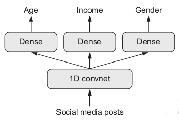
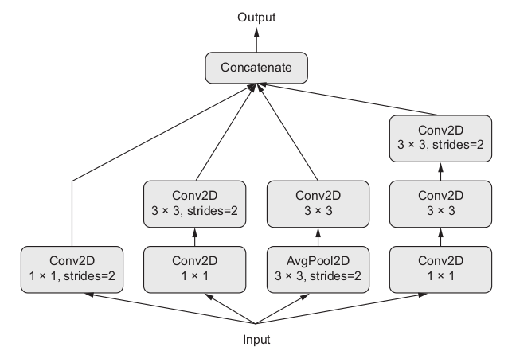

```{r setup, include=FALSE}
options(htmltools.dir.version = FALSE)
```

```{r xaringan-themer, include = FALSE}
library(xaringanthemer)
mono_accent(
  base_color = "#006d6f"
)
```

```{r, load_refs, echo=FALSE, cache=FALSE}
library(RefManageR)
BibOptions(check.entries = FALSE, 
           bib.style = "authoryear", 
           cite.style = 'alphabetic', 
           style = "markdown",
           hyperlink = FALSE, 
           dashed = FALSE)
bib <- ReadBib("./bibliography.bib", check = FALSE)
```

# Topics

- Using the Keras Functional API

- _Entity embeddings_ 1: Extracting relationships

- _Entity embeddings_ 2: Improving accuracy

- Extended exercise: Predict salary on the "Census Income" dataset


---
class: inverse, middle, center

# Using the Keras functional API


---
# When the Keras Sequential API is not enough


Let's look at some typical code observing the Sequential API:

```{r, eval=FALSE}
model <- keras_model_sequential() %>%
layer_dense(units = 32, activation = "relu", input_shape = c(64)) %>%
layer_dense(units = 10, activation = "softmax")
```

Or:

```{r, eval=FALSE}
feature_extractor <-
  application_xception(include_top = FALSE, input_shape = c(224, 224, 3))
model <- keras_model_sequential() %>%
  feature_extractor %>%
  layer_dense(units = 512, activation = "relu") %>%
  layer_batch_normalization() %>%
  layer_dropout(rate = 0.5) %>%
  layer_dense(units = 20, activation = "softmax")
```

<br />

What can you __not__ do with this kind of architecture?

---
# Multiple inputs

Example tasks:

- Predict the price of an item from metadata (size, color ...), a verbal description, and an image

- Question answering: The NN is given a source text (sentence, paragraph) and a question, and should answer that question


.pull-left[]
.pull-right[]

---
# Multiple outputs

Example tasks:

- For a short story, predict genre and date written

- Predict age, income and gender from a series of tweets of a person


<br />

.pull-left[]
.pull-right[]

---
# Internal branching/submodules

Two famous architectures encountered in computer vision:

- InceptionV[n] family: inception module

- ResNet family: residual connections

.pull-left[]
.pull-right[]

---
# Functional API - Overall structure


---
# Multiple inputs - Question answering example

```{r, eval=FALSE}
text_input <- layer_input(shape = list(NULL), dtype = "int32", name = "text")
encoded_text <- text_input %>%
  layer_embedding(input_dim = 5000, output_dim = 256) %>%
  layer_lstm(units = 128)

question_input <- layer_input(shape = list(NULL), dtype = "int32", name = "question")
encoded_question <- question_input %>%
  layer_embedding(input_dim = 5000, output_dim = 256) %>%
  layer_lstm(units = 128)

concatenated <- layer_concatenate(list(encoded_text, encoded_question))
answer <- concatenated %>%
  layer_dense(units = 5000, activation = "softmax")
```


---
class: inverse, middle, center

# Entity embeddings are all the hype

---
# Most people know embeddings for this

(or something like this)


---
# But not just words or sentences can be embedded...

- relations of all kinds (e.g., in knowledge bases)
- 


tbd mention collaborative filtering


---
# Extracting embeddings from a trained model

- _The embeddings_, that's the weight matrix of an embedding layer

- We obtain the weights from the model and then, can perform dimensionality reduction on it

 - PCA
 - t-SNE
 - ...
 
- Can also calculate similarity between points
- For example, using _cosine similarity_:

$$cos(\theta) = \frac{\mathbf{x^ t}\mathbf{y}}{\mathbf{||x||}\space\mathbf{||y||}}$$

Let's see this in action!


---
class: inverse, middle, center

# Entity embeddings 1: Extracting relationships


---
# Use entity embeddings on the StackOverflow Developer Survey

- The [StackOverflow developer survey](https://insights.stackoverflow.com/survey/2018) has lots of categorical variables that can be used as predictors and/or as targets

- Notebook: [embeddings_so.Rmd](embeddings_so.Rmd)

- Data: [survey_results_public.csv](data/survey_results_public.csv)

- Variable explanations: [survey_results_schema.csv](data/survey_results_schema.csv)

<br />

We'll go through the notebook together and then, you'll pick some variables you're interested in and experiment with them.


---

---
class: inverse, middle, center

# Entity embeddings 2: Improving accuracy


---
class: inverse, middle, center

# Extended exercise: Predict salary on the "Census Income" dataset


- "Census Income" (a.k.a. "Adult") dataset available at [UCI Machine Learning Repository](http://mlr.cs.umass.edu/ml/datasets/Census+Income)

- Task is to predict predict binarized salary (< resp. > 50k)

- The dataset has continuous as well as categorical variables

- Notebook to follow along: [heterogeneous_data.Rmd](../notebooks/heterogeneous_data.Rmd)


---

# bla

- bla


```{r, echo=FALSE, results=FALSE}
c1 <- Citet(bib, key = "Goodfellow-et-al-2016", .opts = list(cite.style = "authoryear"))
```

.footnote[[1] cf. `r c1`, chap. 15, ]

---
# Wrapup/feedback


---
# References

```{r, results='asis', echo=FALSE}
PrintBibliography(bib, start = 1, end = 5)
```
