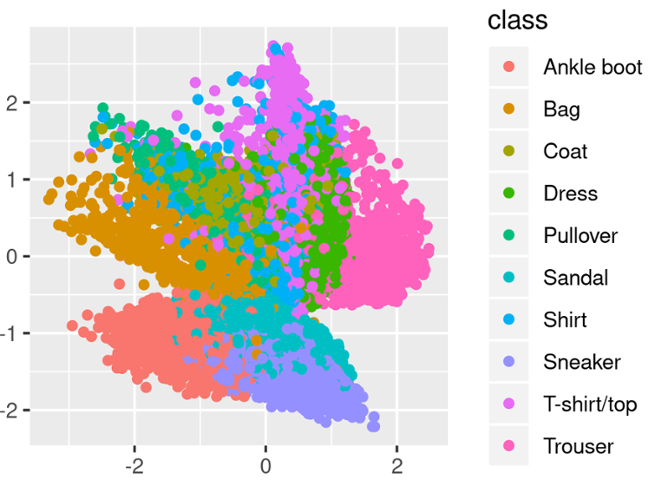
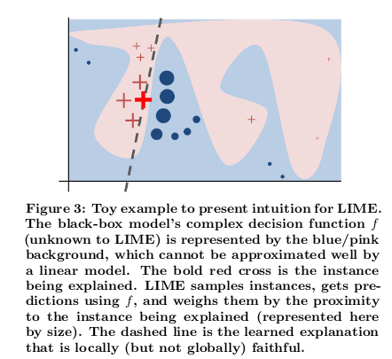
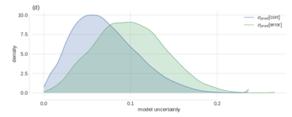

```{r setup, include=FALSE}
options(htmltools.dir.version = FALSE)
```

```{r xaringan-themer, include = FALSE}
library(xaringanthemer)
mono_accent(
  base_color = "#006d6f"
)
```

```{r, load_refs, echo=FALSE, cache=FALSE}
library(RefManageR)
BibOptions(check.entries = FALSE, 
           bib.style = "authoryear", 
           cite.style = 'alphabetic', 
           style = "markdown",
           hyperlink = FALSE, 
           dashed = FALSE)
bib <- ReadBib("./bibliography.bib", check = FALSE)
```

# Representation learning, interpretability, and uncertainty

What do these topics have in common?

--

- Terms are not necessarily well-defined
- We'll keep out of terminology-related controversies, and
- Focus on the code

--

The idea being: Enable you to apply what's useful to you _in your area of work/interest_

---
class: inverse, middle, center

# Representation learning


---

# Why representation learning?

- Representation matters<sup>1</sup>
- Good representations make subsequent prediction task easier 
- Make use of abundant unlabeled data (unsupervised pretraining)
- Transfer learning / domain adaptation
- Density estimation
- Object generation


```{r, echo=FALSE, results=FALSE}
c1 <- Citet(bib, key = "Goodfellow-et-al-2016", .opts = list(cite.style = "authoryear"))
c2 <- Citet(bib, key = "5538", .opts = list(cite.style = "authoryear"))
```

.footnote[[1] cf. `r c1`, chap. 15, and `r c2`.]

---

## Variational autoencoders (VAEs)

- often used in object generation
- learn a _latent space_ that can be sampled from
- learning objective is a tradeoff between faithful input reconstruction and conforming to a (regularizing) prior
- Minimize: Evidence lower bound (ELBO)

$$ELBO\ = \ E[log\ p(x|z)]\ -\ KL(q(z)||p(z))$$

--

#### Problems with traditional VAEs

- may learn uninformative latent space
- tends to overfit the data

---

# InfoVAE and subtypes

- designed to learn more meaningful features
- e.g. by maximizing mutual information between latent space prior and posterior
- we'll see a subtype (MMD-VAE) soon

--

But before, we need some background on

---
class: inverse, middle, center

# Eager execution


---

# Eager execution

- The non-graph way of doing TensorFlow/Keras
- More intuitive than static Keras/TF especially if not following the usual define-compile-fit cycle:
  - encoder-decoder models (as in GANs, VAEs ...)
  - neural style transfer
  - models with attention mechanisms
  
--

#### Detailed examples on the TensorFlow for R blog:

- [More flexible models with TensorFlow eager execution and Keras](https://blogs.rstudio.com/tensorflow/posts/2018-10-02-eager-wrapup/)
- [Image-to-image translation with pix2pix](https://blogs.rstudio.com/tensorflow/posts/2018-09-20-eager-pix2pix/)
- [Attention-based Image Captioning with Keras](https://blogs.rstudio.com/tensorflow/posts/2018-09-17-eager-captioning/)
- [Neural style transfer with eager execution and Keras](https://blogs.rstudio.com/tensorflow/posts/2018-09-10-eager-style-transfer/)
- [Generating images with Keras and TensorFlow eager execution](https://blogs.rstudio.com/tensorflow/posts/2018-08-26-eager-dcgan/)
- [Attention-based Neural Machine Translation with Keras](https://blogs.rstudio.com/tensorflow/posts/2018-07-30-attention-layer/)


---

# Eager execution exercise

- demo: [eager_intro.Rmd](../notebooks/eager_intro.Rmd)
- exercise: [4_meta_quizzes.Rmd](../exercises/4_meta_quizzes.Rmd)


---
class: inverse, middle, center

# Variational autoencoder (MMD-VAE)


---

# Representation learning with MMD-VAE

- Idea described in _InfoVAE: Information Maximizing Variational Autoencoders_<sup>1</sup>

- Read up later here: [Representation learning with MMD-VAE](https://blogs.rstudio.com/tensorflow/posts/2018-10-22-mmd-vae)

- Complete code here: [mmd_cvae.R](https://github.com/rstudio/keras/blob/master/vignettes/examples/mmd_cvae.R)

- We'll take a bird's view here, not going into every detail

```{r, echo=FALSE, results=FALSE}
c1 <- Citet(bib, key = "ZhaoSE17b", .opts = list(cite.style = "authoryear"))
```

.footnote[[1] cf. `r c1`]

---
# MMD-VAE, main steps (1): data streaming

```{r, eval=FALSE}
library(keras)
use_implementation("tensorflow")
library(tensorflow)
tfe_enable_eager_execution(device_policy = "silent")

library(tfdatasets)
# also load dplyr, ggplot2, glue

fashion <- dataset_fashion_mnist()
c(train_images, train_labels) %<-% fashion$train
c(test_images, test_labels) %<-% fashion$test

train_x <- train_images %>% `/`(255) %>%
  k_reshape(c(60000, 28, 28, 1))

test_x <- test_images %>% `/`(255) %>%
  k_reshape(c(10000, 28, 28, 1))

buffer_size <- 60000
batch_size <- 100

{{train_dataset <- tensor_slices_dataset(train_x) %>%
  dataset_shuffle(buffer_size) %>%
  dataset_batch(batch_size)}}
```

---
# MMD-VAE, main steps (2): encoder model

```{r, eval=FALSE}
encoder_model <- function(name = NULL) {
  keras_model_custom(name = name, function(self) {
{{    self$conv1 <- 
      layer_conv_2d(}}             # actually a convolutional encoder
        filters = 32,
        kernel_size = 3,
        strides = 2,
        activation = "relu")
     self$conv2 <-
      layer_conv_2d(
        filters = 64,
        kernel_size = 3,
        strides = 2,
        activation = "relu")
    self$flatten <- layer_flatten()
   {{self$dense <- layer_dense(units = latent_dim)}}     # 2 for easy viz
    function (x, mask = NULL) {
      x %>%
        self$conv1() %>%
        self$conv2() %>%
        self$flatten() %>%
        self$dense()
      }})}
```


---
# MMD-VAE, main steps (3): decoder model


```{r, eval=FALSE}
decoder_model <- function(name = NULL) {
  
  keras_model_custom(name = name, function(self) {
    self$dense <- layer_dense(units = 7 * 7 * 32, activation = "relu")
    self$reshape <- layer_reshape(target_shape = c(7, 7, 32))
{{    self$deconv1 <-}} # first of 3 up-convolutions
      layer_conv_2d_transpose(
        filters = 64,
        kernel_size = 3,
        strides = 2,
        padding = "same",
        activation = "relu"
      )
 {{ self$deconv2 <- }} # another conv_2d_transpose, filters=32
 {{ self$deconv3 <- }} # another conv_2d_transpose, filters=1
    function (x, mask = NULL) {
      x %>%
        self$dense() %>%
        self$reshape() %>%
        self$deconv1() %>%
        self$deconv2() %>%
        self$deconv3()
    }
  })}
```

---
# MMD-VAE, main steps (4): MMD loss

The loss, _maximum mean discrepancy_ (MMD), is based on the idea that two distributions are identical if and only if all moments are identical. 

Concretely, MMD is estimated using a _kernel_, such as the Gaussian kernel

$$k(z,z')=\frac{e^{||z-z'||}}{2\sigma^2}$$

to assess similarity between distributions.

The idea then is that if two distributions are identical, the average similarity between samples from each distribution should be identical to the average similarity between mixed samples from both distributions:

$$MMD(p(z)||q(z))=E_{p(z),p(z')}[k(z,z')]+E_{q(z),q(z')}[k(z,z')]−2E_{p(z),q(z')}[k(z,z')]$$

---
# MMD-VAE, main steps (4): MMD loss


```{r, eval=FALSE}
compute_kernel <- function(x, y) {
  x_size <- k_shape(x)[1]
  y_size <- k_shape(y)[1]
  dim <- k_shape(x)[2]
  tiled_x <- k_tile(
    k_reshape(x, k_stack(list(x_size, 1, dim))),
    k_stack(list(1, y_size, 1))
  )
  tiled_y <- k_tile(
    k_reshape(y, k_stack(list(1, y_size, dim))),
    k_stack(list(x_size, 1, 1))
  )
  k_exp(-k_mean(k_square(tiled_x - tiled_y), axis = 3) /
          k_cast(dim, tf$float64))
}

compute_mmd <- function(x, y, sigma_sqr = 1) {
  x_kernel <- compute_kernel(x, x)
  y_kernel <- compute_kernel(y, y)
  xy_kernel <- compute_kernel(x, y)
  k_mean(x_kernel) + k_mean(y_kernel) - 2 * k_mean(xy_kernel)
}
```


---
# MMD-VAE, main steps (5): training loop

```{r, eval=FALSE}
for (epoch in seq_len(num_epochs)) {
  iter <- make_iterator_one_shot(train_dataset)
  until_out_of_range({
    x <-  iterator_get_next(iter)
    with(tf$GradientTape(persistent = TRUE) %as% tape, {
      mean <- encoder(x)
      preds <- decoder(mean)
      true_samples <- k_random_normal(
        shape = c(batch_size, latent_dim), dtype = tf$float64)
    {{loss_mmd <- compute_mmd(true_samples, mean)
      loss_nll <- k_mean(k_square(x - preds))
      loss <- loss_nll + loss_mmd}}
    })
    encoder_gradients <- tape$gradient(loss, encoder$variables)
    decoder_gradients <- tape$gradient(loss, decoder$variables)
    optimizer$apply_gradients(purrr::transpose(list(
      encoder_gradients, encoder$variables
    )),
    global_step = tf$train$get_or_create_global_step())
    optimizer$apply_gradients(purrr::transpose(list(
      decoder_gradients, decoder$variables
    )),
    global_step = tf$train$get_or_create_global_step())
  })}
```


---
# MMD-VAE: Generated images


---
# MMD-VAE: Latent space



---
# MMD-VAE: Interpolations


---
# Variational autoencoders: Exercise

- exercise: [4_meta_quizzes.Rmd](../exercises/4_meta_quizzes.Rmd)


---
class: inverse, middle, center

# Interpretability

---
# Interpretability/explainability

- Everybody wants it but it's actually not a well-defined term
- Commonly, a division is made between _interpreting a model_ and _explaining model decisions_
- But see e.g. "The Mythos of Model Interpretability"<sup>1</sup> for the lack of agreed-upon definitions
- Here, we'll skip any theoretical discussion and focus on two different ways of _local explanations_
- Just one quote on the theory before we leave that be<sup>2</sup>

> However, it is
fair to say that most work in explainable artificial intelligence uses only the researchers’
intuition of what constitutes a ‘good’ explanation.  There exists vast and valuable bodies
of research in philosophy, psychology, and cognitive science of how people define, generate, select, evaluate, and present explanations, which argues that people employ certain
cognitive  biases  and  social  expectations  towards  the  explanation  process. 

```{r, echo=FALSE, results=FALSE}
c1 <- Citet(bib, key = "Lipton16a", .opts = list(cite.style = "authoryear"))
c2 <- Citet(bib, key = "Miller17a", .opts = list(cite.style = "authoryear"))
```


.footnote[[1] cf. `r c1`

[2] cf. `r c2`]

---
# LIME<sup>1</sup>

.pull-left[]
.pull-right[]

```{r, echo=FALSE, results=FALSE}
c1 <- Citet(bib, key = "RibeiroSG16", .opts = list(cite.style = "authoryear"))
```


.footnote[[1] cf. `r c1`]


---
# LIME on images

- Uses obfuscation on differently-sized _superpixels_
- As LIME works by switching presence of superpixels on and off, obtaining an explanation for a high-res image can take some time
- We will thus resize images before passing them to LIME as anyway the model will work with that size


---
# LIME (1): Create an explainer

##### We first create an _explainer_ using the `lime` factory function

```{r, eval=FALSE}
# the first argument is the path to the image
# the second argument should indicate to LIME the type of model
# the third argument is a preprocessing function we need to define

explainer <- lime(img_path, as_classifier(model, labels), image_prep)
```


##### And here's the preprocessing function that has to be passed to `lime`

```{r, eval=FALSE}
image_prep <- function(x) {
  arrays <- lapply(x, function(path) {
    img <- image_load(path, target_size = c(224,224)) %>%
      image_to_array()
    img <- img %>%
      array_reshape(c(1, dim(img))) %>%
      imagenet_preprocess_input()
  })
  do.call(abind::abind, c(arrays, list(along = 1)))
}
```


---
# LIME(2): Get a prediction

##### This also allows to test the preprocessing function

```{r, eval=FALSE}
preds <- predict(model, image_prep(img_path))
```

##### Decode prediction

```{r, eval=FALSE}
preds %>% imagenet_decode_predictions()
```

```
  class_name   class_description      score
1  n02782093           balloon    9.999470e-01
2  n03888257         parachute    3.710761e-05
3  n02692877           airship    1.597529e-05
4  n04562935       water_tower    4.031146e-08
5  n04507155          umbrella    2.227399e-08
```

---
# LIME (3): Explore superpixels

##### Explore different settings for number of superpixels before actually getting an explanation:

```{r, eval=FALSE}
plot_superpixels(img_path, colour = "cyan",
                 n_superpixels = 50, weight = 10)
plot_superpixels(img_path, colour = "cyan",
                 n_superpixels = 200, weight = 10)
```


---
# LIME (4): Get explanation

##### Call `explain` with the path to the image, the `explainer`, and optional parameters:

```{r, eval=FALSE}
explanation <- explain(
  img_path, 
  explainer,
  n_labels = 1, 
  n_features = 200,
  n_superpixels = 200,
  weight = 20)
```

```{r, eval=FALSE}
plot_image_explanation(explanation, fill_alpha = 0.6)
plot_image_explanation(explanation, display = "block", block_col = "violet")
```


---
# Class activation maps (CAM)

- For a given input image, class activation maps take the __output feature maps__ of a convolution layer and __weigh__ every channel in that feature map by the __gradient of the most probable class__ with respect to the channel.

- Meaning: How much would that class probability change if that channel's activations were to change?


---
# CAM (1): Get the most probable class

```{r, eval=FALSE}
preds <- model %>% predict(img)
max_pred <- which.max(preds[1,])

image_output <- model$output[, max_pred]
```

We will want to compute this class output's gradient with respect to the activations of all channels in the last conv layer.

---
# CAM (2): Get the last conv layer's output

```{r, eval=FALSE}
last_conv_layer <- model %>% get_layer("block5_conv3")
last_conv_layer_output <- last_conv_layer$output
```

These are the activations w.r.t. which we want to compute the class probability's gradient.

---
# CAM (3): Fetch the pooled gradients


We build a little graph to fetch and average the gradients - and run it.

```{r, eval=FALSE}
grads <- k_gradients(image_output, last_conv_layer_output)[[1]]
# average gradients over all but the channel dimension
pooled_grads <- k_mean(grads, axis = c(1, 2, 3))

iterate <- k_function(
  list(model$input),
  list(pooled_grads, last_conv_layer_output[1, , , ])
)

c(pooled_grads_value, conv_layer_output_value) %<-% iterate(list(img))
```


---
# CAM (4): Multiply outputs by channel gradients

This weights up the channels that have high impact on the classification.

```{r, eval=FALSE}
for (i in 1:512) {
  conv_layer_output_value[ , , i] <- 
    conv_layer_output_value[ , , i] * pooled_grads_value[i] 
}
```

Averaging over the channels dimension yields the heatmap:


```{r, eval=FALSE}
heatmap <- apply(conv_layer_output_value, c(1,2), mean)
```

---
# CAM (5): Heatmap (overlayed over image)


---
# LIME/CAM: Exercise

- demo: [lime.Rmd](../notebooks/lime.Rmd) (not needed for this exercise)
- demo: [class_activation_maps.Rmd](../notebooks/class_activation_maps.Rmd) (not needed for this exercise)
- exercise: [4_meta_quizzes.Rmd](../exercises/4_meta_quizzes.Rmd)


---
class: inverse, middle, center
# Obtaining uncertainty estimates from neural networks

---
# Why uncertainty estimates?

- If we can _quantify_ network uncertainty, we can take appropriate measures (like, have humans inspect uncertain cases)<sup>1</sup>
- If we can _qualify_ network uncertainty (as in, e.g., reducible vs. irreducible), we can take appropriate counteractions (e.g., factoring in error margins)



- However, this is uncharted territory _to a higher degree even_  than interpretability (where we've just seen two out of quite a few available approaches)
- There is one rather established approach for this though 


```{r, echo=FALSE, results=FALSE}
c1 <- Citet(bib, key = "Leibig084210", .opts = list(cite.style = "authoryear"))
```


.footnote[[1] cf. `r c1`]

---
# Uncertainty estimates through Bayesian deep learning

- Apply dropout at test time (Gal & Gharahmani 2016<sup>1</sup>)
- Have the network learn the dropout rate (Gal et al. 2017<sup>2</sup>, Kendall & Gal 2017<sup>3</sup>)
- We are going to look at the latter approach

```{r, echo=FALSE, results=FALSE}
c1 <- Citet(bib, key = "GalG16", .opts = list(cite.style = "authoryear"))
c2 <- Citet(bib, key = "2017arXiv170507832G", .opts = list(cite.style = "authoryear"))
c3 <- Citet(bib, key = "NIPS2017_7141", .opts = list(cite.style = "authoryear"))
```


.footnote[
[1] cf. `r c1`

[2] cf. `r c2`

[3] cf. `r c3`
]

---
# Types of uncertainty

- Epistemic: What the model doesn't know (reducible by more data)
- Aleatoric: Variations due to sampling/measurement process (irreducible)


Example from class segmentation:<sup>1</sup>


```{r, echo=FALSE, results=FALSE}
c1 <- Citet(bib, key = "NIPS2017_7141", .opts = list(cite.style = "authoryear"))
```

.footnote[
[1] cf. `r c1`]


---
# Implementation in R

- Implementation follows the authors' Python Keras version
- Read up later here: [You sure? A Bayesian approach to obtaining uncertainty estimates from neural networks](https://blogs.rstudio.com/tensorflow/posts/2018-11-12-uncertainty_estimates_dropout/)
- Consists of 4 parts: a layer wrapper, a modified model, a specific loss function, and Monte Carlo prediction

---
# Wrapper class (extract)

The wrapper's purpose is to calculate the optimal dropout rate for the layer it wraps.

```{r, eval=FALSE}
# R6 wrapper class, a subclass of KerasWrapper
ConcreteDropout <- R6::R6Class("ConcreteDropout",
  
  inherit = KerasWrapper,
  
  public = list(
    # [...]
    initialize = function( # [...]
    
    build = function(input_shape) {
      super$build(input_shape)
    {{self$p_logit <- super$add_weight(}}# [...]
      # [...]
      regularizer <- k_sum(kernel_regularizer + dropout_regularizer)
    {{super$add_loss(regularizer)}}
    },
    
    concrete_dropout = function(x) { # [...]
      
    call = function(x, mask = NULL, training = NULL) {# [...]
  )
)

```


---
# Dropout model (1)

This example has 3 hidden dense layers each wrapped with `ConcreteDropout`.

```{r,eval=FALSE}
output <- input %>% layer_concrete_dropout(
  layer = layer_dense(units = hidden_dim, activation = "relu"),
  # [...]
  ) %>% layer_concrete_dropout(
  layer = layer_dense(units = hidden_dim, activation = "relu"),
  # [...]
  ) %>% layer_concrete_dropout(
  layer = layer_dense(units = hidden_dim, activation = "relu"),
  # [...]
)
```

---
# Dropout model (2)

The model outputs not just the _predictive (conditional) mean_, but also the _predictive variance_:

```{r, eval=FALSE}
mean <- output %>% layer_concrete_dropout(
  layer = layer_dense(units = output_dim),
  # [...]
)

log_var <- output %>% layer_concrete_dropout(
  layer_dense(units = output_dim),
  # [...]
)
output <- layer_concatenate(list(mean, log_var))
model <- keras_model(input, output)
```

- This means we can learn _different variances for different data points_. 
- We thus hope to be able to account for _heteroscedasticity_ in the data.

---
# Heteroscedastic loss (1)

Instead of mean squared error we use a cost function that does not treat all estimates alike:

$$\frac{1}{N} \sum_i{\frac{1}{2 \hat{\sigma}^2_i} \ (\mathbf{y}_i - \mathbf{\hat{y}}_i)^2 + \frac{1}{2} log \ \hat{\sigma}^2_i}$$

In addition to the target vs. prediction check, this cost function contains two regularization terms: 

- $\frac{1}{2 \hat{\sigma}^2_i}$ downweights the high-uncertainty predictions in the loss function. The model is encouraged to indicate high uncertainty when its predictions are false.

- $\frac{1}{2} log \ \hat{\sigma}^2_i$ makes sure the network does not simply indicate high uncertainty everywhere.

---
# Heteroscedastic loss (2)

R code (calculating with the log of the variance):

```{r, eval=FALSE}
heteroscedastic_loss <- function(y_true, y_pred) {
    mean <- y_pred[, 1:output_dim]
    log_var <- y_pred[, (output_dim + 1):-1]
    precision <- k_exp(-log_var)
    k_sum(precision * (y_true - mean) ^ 2 + log_var, axis = 2)
}

model %>% compile(
  optimizer = "adam",
  loss = heteroscedastic_loss,
  metrics = c(custom_metric("heteroscedastic_loss", heteroscedastic_loss))
)
```


---
# Obtain uncertainty estimates (Monte Carlo)

```{r, eval=FALSE}
MC_samples <- array(0, dim = c(num_MC_samples, n_val, 2 * output_dim))
for (k in 1:num_MC_samples) {
  MC_samples[k, , ] <- (model %>% predict(X_val))
}
```

Epistemic uncertainty is calculated from the model's "mean" output:

```{r, eval=FALSE}
means <- MC_samples[, , 1:output_dim] 
# predictive mean (average over the MC samples)
predictive_mean <- apply(means, 2, mean) 
# epistemic_uncertainty = variance of the "mean" component of the MC samples
epistemic_uncertainty <- apply(means, 2, var) 
```


While aleatoric uncertainty is calculated from the "variance" output:

```{r, eval=FALSE}
# aleatoric_uncertainty = mean of the "variance" component of the MC samples
logvar <- MC_samples[, , (output_dim + 1):dim(MC_samples)[3]]
aleatoric_uncertainty <- exp(colMeans(logvar))
```

---
# Results: Epistemic uncertainty

Epistemic uncertainty on validation set (simulated data, x is Gaussian distributed, _train_n_ = 1000).


Uncertainty is high in regions where the model has not seen many datapoints.

---
# Results: Aleatoric uncertainty

Aleatoric uncertainty on validation set (simulated data, x is Gaussian distributed, _train_n_ = 1000).


The amount of data seen does not affect irreducible uncertainty.

---
# Results: Predictive uncertainty

Overall predictive uncertainty on validation set (simulated data, x is Gaussian distributed, _train_n_ = 1000).


Both types of uncertainty add to yield the final predictive uncertainty.


---
# Wrapup/feedback


---
# References

```{r, results='asis', echo=FALSE}
PrintBibliography(bib, start = 1, end = 5)
```

---
# References (cont.)

```{r, results='asis', echo=FALSE}
PrintBibliography(bib, start = 6, end = 10)
```
