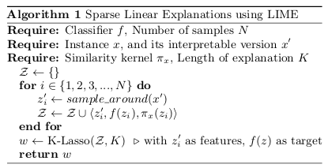
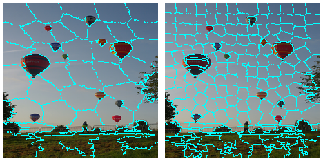

```{r setup, include=FALSE}
options(htmltools.dir.version = FALSE)
```

```{r xaringan-themer, include = FALSE}
library(xaringanthemer)
mono_accent(
  base_color = "#006d6f"
)
```

```{r, load_refs, echo=FALSE, cache=FALSE}
library(RefManageR)
BibOptions(check.entries = FALSE, 
           bib.style = "authoryear", 
           cite.style = 'alphabetic', 
           style = "markdown",
           hyperlink = FALSE, 
           dashed = FALSE)
bib <- ReadBib("./bibliography.bib", check = FALSE)
```

# Representation learning, interpretability, and uncertainty

What do these topics have in common?

--

- Terms are not necessarily well-defined
- We'll keep out of terminology-related controversies, and
- Focus on the code

--

The idea being: Enable you to apply what's useful to you _in your area of work/interest_

---
class: inverse, middle, center

# Representation learning


---

# Why representation learning?

- Representation matters<sup>1</sup>
- Good representations make subsequent prediction task easier 
- Make use of abundant unlabeled data (unsupervised pretraining)
- Transfer learning / domain adaptation
- Density estimation
- Object generation


```{r, echo=FALSE, results=FALSE}
c1 <- Citet(bib, key = "Goodfellow-et-al-2016", .opts = list(cite.style = "authoryear"))
c2 <- Citet(bib, key = "5538", .opts = list(cite.style = "authoryear"))
```

.footnote[[1] cf. `r c1`, chap. 15, and `r c2`.]

---

## Variational autoencoders (VAEs)

- often used in object generation
- learn a _latent space_ that can be sampled from
- learning objective is a tradeoff between faithful input reconstruction and conforming to a (regularizing) prior
- Minimize: Evidence lower bound (ELBO)

$$ELBO\ = \ E[log\ p(x|z)]\ -\ KL(q(z)||p(z))$$

--

#### Problems with traditional VAEs

- may learn uninformative latent space
- tends to overfit the data

---

# InfoVAE and subtypes

- designed to learn more meaningful features
- e.g. by maximizing mutual information between latent space prior and posterior
- we'll see a subtype (MMD-VAE) soon

--

But before, we need some background on

---
class: inverse, middle, center

# Eager execution


---

# Eager execution

- The non-graph way of doing TensorFlow/Keras
- More intuitive than static Keras/TF especially if not following the usual define-compile-fit cycle:
  - encoder-decoder models (as in GANs, VAEs ...)
  - neural style transfer
  - models with attention mechanisms
  
--

#### Detailed examples on the TensorFlow for R blog:

- [More flexible models with TensorFlow eager execution and Keras](https://blogs.rstudio.com/tensorflow/posts/2018-10-02-eager-wrapup/)
- [Image-to-image translation with pix2pix](https://blogs.rstudio.com/tensorflow/posts/2018-09-20-eager-pix2pix/)
- [Attention-based Image Captioning with Keras](https://blogs.rstudio.com/tensorflow/posts/2018-09-17-eager-captioning/)
- [Neural style transfer with eager execution and Keras](https://blogs.rstudio.com/tensorflow/posts/2018-09-10-eager-style-transfer/)
- [Generating images with Keras and TensorFlow eager execution](https://blogs.rstudio.com/tensorflow/posts/2018-08-26-eager-dcgan/)
- [Attention-based Neural Machine Translation with Keras](https://blogs.rstudio.com/tensorflow/posts/2018-07-30-attention-layer/)


---

# Eager execution exercise

- demo: [eager_intro.Rmd](../notebooks/eager_intro.Rmd)
- exercise: [4_meta_quizzes.Rmd](../exercises/4_meta_quizzes.Rmd)


---
class: inverse, middle, center

# Variational autoencoder (MMD-VAE)


---

# Representation learning with MMD-VAE

- Idea described in _InfoVAE: Information Maximizing Variational Autoencoders_<sup>1</sup>

- Read up later here: [Representation learning with MMD-VAE](https://blogs.rstudio.com/tensorflow/posts/2018-10-22-mmd-vae)

- Complete code here: [mmd_cvae.R](https://github.com/rstudio/keras/blob/master/vignettes/examples/mmd_cvae.R)

- We'll take a bird's view here, not going into every detail

```{r, echo=FALSE, results=FALSE}
c1 <- Citet(bib, key = "ZhaoSE17b", .opts = list(cite.style = "authoryear"))
```

.footnote[[1] cf. `r c1`]

---
# MMD-VAE, main steps (1): data streaming

```{r, eval=FALSE}
library(keras)
use_implementation("tensorflow")
library(tensorflow)
tfe_enable_eager_execution(device_policy = "silent")

library(tfdatasets)
# also load dplyr, ggplot2, glue

fashion <- dataset_fashion_mnist()
c(train_images, train_labels) %<-% fashion$train
c(test_images, test_labels) %<-% fashion$test

train_x <- train_images %>% `/`(255) %>%
  k_reshape(c(60000, 28, 28, 1))

test_x <- test_images %>% `/`(255) %>%
  k_reshape(c(10000, 28, 28, 1))

buffer_size <- 60000
batch_size <- 100

{{train_dataset <- tensor_slices_dataset(train_x) %>%
  dataset_shuffle(buffer_size) %>%
  dataset_batch(batch_size)}}
```

---
# MMD-VAE, main steps (2): encoder model

```{r, eval=FALSE}
encoder_model <- function(name = NULL) {
  keras_model_custom(name = name, function(self) {
{{    self$conv1 <- 
      layer_conv_2d(}}             # actually a convolutional encoder
        filters = 32,
        kernel_size = 3,
        strides = 2,
        activation = "relu")
     self$conv2 <-
      layer_conv_2d(
        filters = 64,
        kernel_size = 3,
        strides = 2,
        activation = "relu")
    self$flatten <- layer_flatten()
   {{self$dense <- layer_dense(units = latent_dim)}}     # 2 for easy viz
    function (x, mask = NULL) {
      x %>%
        self$conv1() %>%
        self$conv2() %>%
        self$flatten() %>%
        self$dense()
      }})}
```


---
# MMD-VAE, main steps (3): decoder model


```{r, eval=FALSE}
decoder_model <- function(name = NULL) {
  
  keras_model_custom(name = name, function(self) {
    self$dense <- layer_dense(units = 7 * 7 * 32, activation = "relu")
    self$reshape <- layer_reshape(target_shape = c(7, 7, 32))
{{    self$deconv1 <-}} # first of 3 up-convolutions
      layer_conv_2d_transpose(
        filters = 64,
        kernel_size = 3,
        strides = 2,
        padding = "same",
        activation = "relu"
      )
 {{ self$deconv2 <- }} # another conv_2d_transpose, filters=32
 {{ self$deconv3 <- }} # another conv_2d_transpose, filters=1
    function (x, mask = NULL) {
      x %>%
        self$dense() %>%
        self$reshape() %>%
        self$deconv1() %>%
        self$deconv2() %>%
        self$deconv3()
    }
  })}
```

---
# MMD-VAE, main steps (4): MMD loss

The loss, _maximum mean discrepancy_ (MMD), is based on the idea that two distributions are identical if and only if all moments are identical. 

Concretely, MMD is estimated using a _kernel_, such as the Gaussian kernel

$$k(z,z')=\frac{e^{||z-z'||}}{2\sigma^2}$$

to assess similarity between distributions.

The idea then is that if two distributions are identical, the average similarity between samples from each distribution should be identical to the average similarity between mixed samples from both distributions:

$$MMD(p(z)||q(z))=E_{p(z),p(z')}[k(z,z')]+E_{q(z),q(z')}[k(z,z')]−2E_{p(z),q(z')}[k(z,z')]$$

---
# MMD-VAE, main steps (4): MMD loss


```{r, eval=FALSE}
compute_kernel <- function(x, y) {
  x_size <- k_shape(x)[1]
  y_size <- k_shape(y)[1]
  dim <- k_shape(x)[2]
  tiled_x <- k_tile(
    k_reshape(x, k_stack(list(x_size, 1, dim))),
    k_stack(list(1, y_size, 1))
  )
  tiled_y <- k_tile(
    k_reshape(y, k_stack(list(1, y_size, dim))),
    k_stack(list(x_size, 1, 1))
  )
  k_exp(-k_mean(k_square(tiled_x - tiled_y), axis = 3) /
          k_cast(dim, tf$float64))
}

compute_mmd <- function(x, y, sigma_sqr = 1) {
  x_kernel <- compute_kernel(x, x)
  y_kernel <- compute_kernel(y, y)
  xy_kernel <- compute_kernel(x, y)
  k_mean(x_kernel) + k_mean(y_kernel) - 2 * k_mean(xy_kernel)
}
```


---
# MMD-VAE, main steps (5): training loop

```{r, eval=FALSE}
for (epoch in seq_len(num_epochs)) {
  iter <- make_iterator_one_shot(train_dataset)
  until_out_of_range({
    x <-  iterator_get_next(iter)
    with(tf$GradientTape(persistent = TRUE) %as% tape, {
      mean <- encoder(x)
      preds <- decoder(mean)
      true_samples <- k_random_normal(
        shape = c(batch_size, latent_dim), dtype = tf$float64)
    {{loss_mmd <- compute_mmd(true_samples, mean)
      loss_nll <- k_mean(k_square(x - preds))
      loss <- loss_nll + loss_mmd}}
    })
    encoder_gradients <- tape$gradient(loss, encoder$variables)
    decoder_gradients <- tape$gradient(loss, decoder$variables)
    optimizer$apply_gradients(purrr::transpose(list(
      encoder_gradients, encoder$variables
    )),
    global_step = tf$train$get_or_create_global_step())
    optimizer$apply_gradients(purrr::transpose(list(
      decoder_gradients, decoder$variables
    )),
    global_step = tf$train$get_or_create_global_step())
  })}
```


---
# MMD-VAE: Generated images


---
# MMD-VAE: Latent space


---
# MMD-VAE: Interpolations


---
# Variational autoencoders: Exercise

- exercise: [4_meta_quizzes.Rmd](../exercises/4_meta_quizzes.Rmd)


---
class: inverse, middle, center

# Interpretability

---
# Interpretability/explainability

- Everybody wants it / demands it but it's actually not a well-defined term
- Commonly, a division is made between _interpreting a model_ and _explaining model decisions_
- But see e.g. "The Mythos of Model Interpretability"<sup>1</sup> for elaboration on the lack of agreed-upon definitions
- Here, we'll skip any theoretical discussion and focus on two different ways of _local explanations_
- Just one quote on the theory before we leave that be<sup>2</sup>

> However, it is
fair to say that most work in explainable artificial intelligence uses only the researchers’
intuition of what constitutes a ‘good’ explanation.  There exists vast and valuable bodies
of research in philosophy, psychology, and cognitive science of how people define, gener-
ate, select, evaluate, and present explanations, which argues that people employ certain
cognitive  biases  and  social  expectations  towards  the  explanation  process. 

```{r, echo=FALSE, results=FALSE}
c1 <- Citet(bib, key = "Lipton16a", .opts = list(cite.style = "authoryear"))
c2 <- Citet(bib, key = "Miller17a", .opts = list(cite.style = "authoryear"))
```


.footnote[[1] cf. `r c1`

[2] cf. `r c2`]

---
# LIME<sup>1</sup>

.pull-left[]
.pull-right[]

```{r, echo=FALSE, results=FALSE}
c1 <- Citet(bib, key = "RibeiroSG16", .opts = list(cite.style = "authoryear"))
```


.footnote[[1] cf. `r c1`]


---
# LIME on images

- Uses obfuscation on differently-sized _superpixels_
- As LIME works by switching presence of superpixels on and off, obtaining an explanation for a high-res image can take some time
- We will thus resize images before passing them to LIME as anyway the model will work with that size


---
# LIME (1): Create an explainer

##### We first create an _explainer_ using the `lime` factory function

```{r, eval=FALSE}
# the first argument is the path to the image
# the second argument should indicate to LIME the type of model
# the third argument is a preprocessing function we need to define

explainer <- lime(img_path, as_classifier(model, labels), image_prep)
```


##### And here's the preprocessing function that has to be passed to `lime`

```{r, eval=FALSE}
image_prep <- function(x) {
  arrays <- lapply(x, function(path) {
    img <- image_load(path, target_size = c(224,224)) %>%
      image_to_array()
    img <- img %>%
      array_reshape(c(1, dim(img))) %>%
      imagenet_preprocess_input()
  })
  do.call(abind::abind, c(arrays, list(along = 1)))
}
```


---
# LIME(2): Get a prediction

##### This also allows to test the preprocessing function

```{r, eval=FALSE}
preds <- predict(model, image_prep(img_path))
```

##### Decode prediction

```{r, eval=FALSE}
preds %>% imagenet_decode_predictions()
```

```
  class_name   class_description      score
1  n02782093           balloon    9.999470e-01
2  n03888257         parachute    3.710761e-05
3  n02692877           airship    1.597529e-05
4  n04562935       water_tower    4.031146e-08
5  n04507155          umbrella    2.227399e-08
```

---
# LIME (3): Explore superpixels

##### Explore different settings for number of superpixels before actually getting an explanation:

```{r, eval=FALSE}
plot_superpixels(img_path, colour = "cyan",
                 n_superpixels = 50, weight = 10)
plot_superpixels(img_path, colour = "cyan",
                 n_superpixels = 200, weight = 10)
```




---
# LIME (4): Get explanation

##### Call `explain` with the path to the image, the `explainer`, and optional parameters:

```{r, eval=FALSE}
explanation <- explain(
  img_path, 
  explainer,
  n_labels = 1, 
  n_features = 200,
  n_superpixels = 200,
  weight = 20)
```

```{r, eval=FALSE}
plot_image_explanation(explanation, fill_alpha = 0.6)
plot_image_explanation(explanation, display = "block", block_col = "violet")
```


---
# LIME: Exercise

- demo: [lime.Rmd](../notebooks/eager_intro.Rmd) (not needed for this exercise)
- exercise: [4_meta_quizzes.Rmd](../exercises/4_meta_quizzes.Rmd)


---
# Class activation maps


---
# References

```{r, 'refs', results='asis', echo=FALSE}
PrintBibliography(bib)
```

